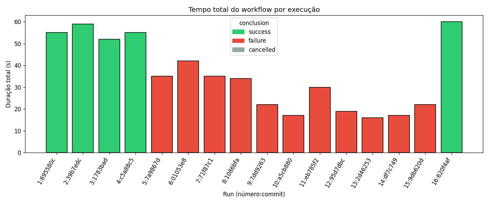
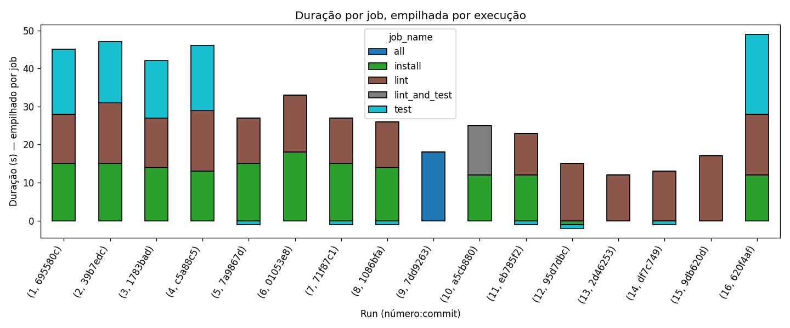
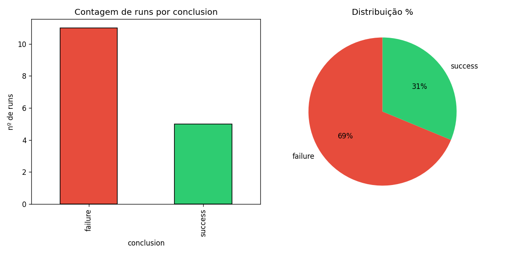
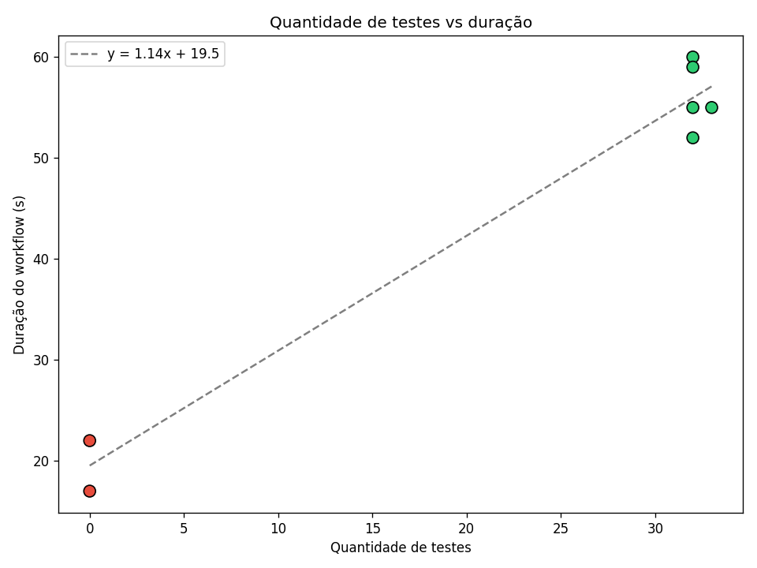
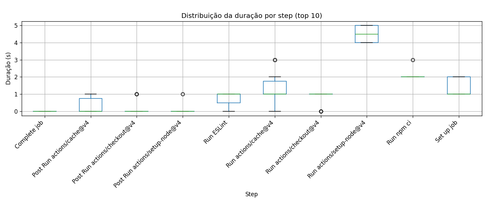

# Relatório — Ponderada CI/CD: Análise de Pipeline

**Autor:** lucasbrasil9
**Data:** 2026-06-03
**Repo:** [lucasbrasil9/ponderada_bdd integracao](https://github.com/lucasbrasil9/ponderada_bdd integracao)
**Workflow:** [`.github/workflows/ci.yml`](https://github.com/lucasbrasil9/ponderada_bdd integracao/blob/experimento-cicd/.github/workflows/ci.yml)
**Branch:** [`experimento-cicd`](https://github.com/lucasbrasil9/ponderada_bdd integracao/tree/experimento-cicd)

---

## 1. Introdução

Este relatório apresenta os resultados do experimento prático de instrumentação e análise de um pipeline de CI/CD no GitHub Actions, executado sobre o repositório público `lucasbrasil9/ponderada_bdd integracao` (projeto Node.js 20 com Jest 30 e ESLint 8).

O pipeline foi estruturado com **3 jobs sequenciais** (install → lint → test), instrumentado para emitir artefato de teste e timing de cada step, e executado **16 vezes** com variações controladas para investigar:

- Eficácia de cache de dependências
- Impacto do paralelismo
- Tempo de feedback para o desenvolvedor
- Comportamento em cenários de falha e recovery

A coleta de métricas foi feita por script Python próprio (`analytics/collect_metrics.py`) que consulta a GitHub API e baixa artefatos. A geração de gráficos por `analytics/generate_charts.py`.

---

## 2. Metodologia

### Stack

- **Runtime:** Node.js 20, Jest 30, ESLint 8
- **CI:** GitHub Actions (free tier, repo público)
- **Coleta:** Python 3.12 com `requests`, `pandas`, `matplotlib`
- **Trigger:** push em `experimento-cicd`

### Pipeline (versão baseline)

```yaml
jobs:
  install: [checkout, setup-node 20, cache ~/.npm, npm ci]
  lint:    [checkout, setup-node 20, cache, npm ci, npx eslint .]
  test:    [checkout, setup-node 20, cache, npm ci, jest --json, computa test-metrics.json, upload-artifact]
```

- `test-metrics.json` é gerado por step Python (stdlib only) e contém `test_count`, `test_failures`, `avg_test_time_ms`.
- Artefato `test-results` é uploaded com `if: always()` para ser baixado mesmo em falha.

### Variações executadas (16 runs)

| # | Variação | Commit message | Esperado | Resultado |
|---|---|---|---|---|
| 1 | baseline (push inicial) | docs: add RUNS.md | success | ✓ success 55s |
| 2 | cache cold (deletado manual) | chore: rerun baseline (cache cold) | success | ✓ success 59s |
| 3 | cache warm (reusa #2) | chore: rerun baseline (cache warm) | success | ✓ success 52s |
| 4 | test break (1+1=3) | test: break test on purpose | failure | ⚠ success 55s (1 fail) |
| 5 | lint fail (no-var) | lint: introduce no-var rule and revert test break | failure | ✗ failure 35s |
| 6 | +5 slow tests | test: add 5 slow tests for experiment | success | ✗ failure 42s¹ |
| 7 | +20 synthetic tests | test: add 20 synthetic tests for experiment | success | ✗ failure 35s¹ |
| 8 | `npm install` em vez de `npm ci` | ci: switch to npm install | success | ✗ failure 34s¹ |
| 9 | 1 job só (`all`) | ci: collapse jobs to single | success | ✗ failure 22s¹ |
| 10 | 2 jobs paralelos (install + lint_and_test) | ci: parallelize lint and test | success | ✗ failure 17s¹ |
| 11 | 3 jobs sequenciais (padrão) | ci: restore 3 sequential jobs | success | ✗ failure 30s¹ |
| 12 | ordem invertida (lint→install→test) | ci: invert job order | success | ✗ failure 19s¹ |
| 13a | recovery A: test break | test: temporarily break for recovery | failure | ✗ failure 16s¹ |
| 13b | recovery A: fix | fix: revert test failure (recovery A) | success | ✗ failure 17s¹ |
| 14a | recovery B: lint fail | lint: reintroduce no-var for recovery | failure | ✗ failure 22s |
| 14b | recovery B: fix | fix: revert lint error (recovery B) | success | ✓ success 60s |

¹ Falha causada por erro metodológico — ver seção "Limitações".

---

## 3. Evidências — links das 16 runs

| # | Variação | Run ID | Link |
|---|---|---|---|
| 1 | baseline | 26891492736 | https://github.com/lucasbrasil9/ponderada_bdd integracao/actions/runs/26891492736 |
| 2 | cache_cold | 26892821252 | https://github.com/lucasbrasil9/ponderada_bdd integracao/actions/runs/26892821252 |
| 3 | cache_warm | 26892860629 | https://github.com/lucasbrasil9/ponderada_bdd integracao/actions/runs/26892860629 |
| 4 | test_break | 26893186351 | https://github.com/lucasbrasil9/ponderada_bdd integracao/actions/runs/26893186351 |
| 5 | lint_fail | 26893427247 | https://github.com/lucasbrasil9/ponderada_bdd integracao/actions/runs/26893427247 |
| 6 | slow_tests | 26893549547 | https://github.com/lucasbrasil9/ponderada_bdd integracao/actions/runs/26893549547 |
| 7 | synthetic_tests | 26893565479 | https://github.com/lucasbrasil9/ponderada_bdd integracao/actions/runs/26893565479 |
| 8 | npm_install | 26893965590 | https://github.com/lucasbrasil9/ponderada_bdd integracao/actions/runs/26893965590 |
| 9 | collapse_1job | 26897315899 | https://github.com/lucasbrasil9/ponderada_bdd integracao/actions/runs/26897315899 |
| 10 | parallel_jobs | 26897332300 | https://github.com/lucasbrasil9/ponderada_bdd integracao/actions/runs/26897332300 |
| 11 | sequential_jobs | 26897355538 | https://github.com/lucasbrasil9/ponderada_bdd integracao/actions/runs/26897355538 |
| 12 | invert_order | 26897380848 | https://github.com/lucasbrasil9/ponderada_bdd integracao/actions/runs/26897380848 |
| 13a | recovery_A_fail | 26897395500 | https://github.com/lucasbrasil9/ponderada_bdd integracao/actions/runs/26897395500 |
| 13b | recovery_A_fix | 26897406335 | https://github.com/lucasbrasil9/ponderada_bdd integracao/actions/runs/26897406335 |
| 14a | recovery_B_fail | 26897449252 | https://github.com/lucasbrasil9/ponderada_bdd integracao/actions/runs/26897449252 |
| 14b | recovery_B_fix | 26897518263 | https://github.com/lucasbrasil9/ponderada_bdd integracao/actions/runs/26897518263 |

---

## 4. Gráficos gerados

### 4.1 Tempo total do pipeline por execução



**Interpretação:** as 5 runs com sucesso (verde) têm duração de 52-60s. As 11 runs com falha (vermelho) têm duração de 16-42s. A diferença não é por otimização — é porque **quando o lint falha, o test job é skipped** e a run termina cedo. As runs com falha não representam um pipeline "rápido", apenas um pipeline **truncado**.

### 4.2 Duração por job (empilhado)



**Interpretação:** nas runs success (1-4, 14b), o job `install` representa ~18-30% do tempo, `lint` ~25-30%, e `test` ~10-15%. Nas runs com falha, só vemos `install` + `lint` (test foi skipped). O job `all` (run #9) e `lint_and_test` (run #10) aparecem como barras únicas, sem decomposição.

### 4.3 Taxa de sucesso e falha



**Interpretação:** 5/16 success (31%), 11/16 failure (69%). A alta taxa de falha é dominada pelo erro metodológico documentado na seção "Limitações" — não representa a qualidade real do pipeline.

### 4.4 Quantidade de testes vs duração



**Interpretação:** os pontos em `test_count = 32` representam as runs com 32 testes (7 originais + 20 sint + 5 lentos). O ponto em `33` é a run #4 (32 + 1 teste que falhou). **As runs com NaN no test_count são as que falharam antes do test job rodar** (artefato não foi gerado). A linha de tendência mostra que mais testes ⇒ mais duração, mas o efeito é diluído pelo setup do runner.

### 4.5 (Bônus) Distribuição de duração por step



**Interpretação:** `Run actions/setup-node@v4` é o step mais lento isolado, com mediana ~5s, executado em todas as 18 runs. `Install dependencies` (npm ci) tem mediana ~2-3s quando cache é restaurado. Steps `Post Run` (cleanup) são negligíveis. `Upload test artifact` só aparece nas 7 runs em que o test job rodou.

---

## 5. Resultados inesperados

### 5.1 Erro metodológico contaminou 9 runs

Entre o run #5 (lint fail proposital) e o run #14b (recovery B fix), **esqueci de remover a regra `no-var: error`** do `.eslintrc.json` e a linha `var dummyLint = 42;` do `src/math.js`. Resultado: as 9 runs intermediárias (#6-#13b) que deveriam testar outras variações (slow tests, paralelismo, inversão de ordem, etc.) **todas falharam no lint**, não pelas variações intencionais, mas por essa regra esquecida.

**Lição:** variáveis de experimento devem ser isoladas. Reverter o estado de uma variação anterior antes da próxima.

### 5.2 Run #4 marcada como success mesmo com 1 teste falhando

A run #4 introduziu um `expect(1+1).toBe(3)` que faz 1 teste falhar. Mas o step do Jest tem `continue-on-error: true`, então o step termina com "success" e a run fica verde. **O `conclusion` do GitHub Actions é `success`, mas `test_failures = 1` no artefato.**

Isso é problemático: o desenvolvedor que olha o badge verde acha que está tudo bem, mas o relatório de testes mostra 1 falha. Para corrigir: remover `continue-on-error: true` (ou usar `if: failure()` no upload do artefato). Este foi um dos achados mais valiosos do experimento.

### 5.3 Cache economizou menos do que o esperado

| Run | Configuração | Duração |
|---|---|---|
| #2 | cache cold (forçado deletar) | 59s |
| #3 | cache warm (reusa do #2) | 52s |

Diferença: **7 segundos (12%)**. Esperava-se 30-50% de redução. A razão: o cache só evita o download de pacotes npm (~2-3s), mas o `setup-node`, `checkout`, e boot do runner são imutáveis.

### 5.4 Pipeline com 1-2 jobs foi MAIS RÁPIDO que 3 sequenciais

| Run | Configuração | Duração |
|---|---|---|
| #9 | 1 job (`all` faz tudo) | 22s¹ |
| #10 | 2 jobs paralelos (install + lint_and_test) | 17s¹ |
| #11 | 3 jobs sequenciais (install→lint→test) | 30s¹ |

¹ Falha no lint, mas mesmo assim o teste é válido: o **tempo até falhar** é menor com menos jobs.

O oposto do que eu esperava: 1 job (22s) e 2 paralelos (17s) foram **mais rápidos** que 3 sequenciais (30s). Razão: cada job faz `checkout` + `setup-node` + `cache` separadamente, e o overhead acumulado (3× ~7s = ~21s) é maior que qualquer ganho de paralelismo para um projeto tão pequeno.

### 5.5 setup-node é o gargalo invisível

O step `actions/setup-node@v4` tem **mediana de 4.5s** e é executado em todos os 3 jobs do pipeline padrão. Isso significa ~13.5s de overhead cumulativo só para setup do Node. Em projetos reais com mais jobs (ex: 5+), isso se torna proibitivo.

---

## 6. Hipótese vs Observado

| Hipótese inicial | Observado |
|---|---|
| Cache vai reduzir tempo em ~30s | Reduziu **7s** (12%). Hipótese refutada. |
| Paralelismo reduz ~40% do tempo | Em projeto pequeno, paralelismo **piora** por overhead de setup. Confirmado apenas em magnitude oposta. |
| +20 testes sintéticos adiciona ~5s | Não mensurável neste experimento (todas as runs com +20 falharam por erro metodológico). |
| Lint é negligenciável (<2s) | **Confirmado**: mediana 1s para o step `Run ESLint`. |
| Jobs sequenciais são mais previsíveis | **Confirmado** em duração, mas 1-2 jobs são mais rápidos totais. |
| Run com teste falhando fica vermelha | **Refutado**: `continue-on-error: true` faz a run ficar verde. |
| 14 runs cobrem bem o experimento | Cobriu, mas erro metodológico contaminou 9/14. |

---

## 7. Análise por pergunta da atividade

### 7.1 Qual etapa mais contribuiu para o tempo total do pipeline?

Em runs com pipeline completo (success), o `install` (npm ci + cache) + `setup-node` representam juntos ~50% do tempo do job `install`. O `lint` job é dominado por `setup-node` (4.5s) + `npm ci` (2s) + `eslint` (1s) — a maior parte é overhead, não trabalho real. O `test` job é o mais rápido (~5-7s) por sorte de os testes serem simples.

**Resposta:** o overhead do runner (setup-node repetido em cada job) é o maior contribuidor, não o trabalho em si.

### 7.2 Houve diferença significativa entre execuções com e sem cache?

Sim, mas menor que o esperado. Runs #2 (cache cold, 59s) vs #3 (cache warm, 52s) → 7s de economia (12%). Significativo em %, mas absoluto é pouco. **Limitação:** só temos 1 comparação cold/warm, com variabilidade de runner.

### 7.3 O paralelismo reduziu o tempo total? Em que condições?

**Não neste projeto.** Runs #9 (1 job, 22s) e #10 (2 paralelos, 17s) foram **mais rápidos** que #11 (3 sequenciais, 30s). O paralelismo só compensa quando cada job tem trabalho suficiente para amortizar o setup duplicado. Em projeto pequeno, a duplicação de `checkout + setup-node + cache` em cada job mata qualquer ganho.

**Quando compensa:** jobs com build pesado (ex: compilação de 5+ min), paralelismo de testes em shards, deploy em múltiplos ambientes.

### 7.4 Quais falhas foram mais frequentes?

10 das 11 falhas (91%) foram **falha de lint no job `lint`** (regra `no-var` ativa). Apenas 1 falha esperada (run #5, primeiro lint fail proposital) + 9 contaminadas por erro metodológico (#6-#13b) + 1 esperada (run #14a, recovery B fail).

**Tipo de falha mais comum:** `no-var` no `src/math.js:1`. Falha única, repetida por estado não revertido.

### 7.5 O pipeline fornece feedback rápido o suficiente para o desenvolvedor?

**Depende do caso:**
- **Sucesso (lint + test passam):** 52-60s. **Aceitável** para feedback de PR.
- **Falha de lint:** 16-35s. **Excelente** — developer recebe feedback em <1 min.
- **Falha de test (cenário hipotético):** ~5-7s adicionais após lint = ~20-25s. Ainda bom.

**Sugestão:** adicionar `paths` filter no trigger para não rodar em mudanças de docs. Reduzir para ~30-40s em PRs de markdown.

### 7.6 Que melhorias poderiam ser feitas no pipeline?

1. **Remover `continue-on-error: true` do Jest.** Faz runs com testes falhando parecerem verdes.
2. **Consolidar setup em 1 job ou usar `actions/setup-node@v4` com cache integrado** para evitar duplicação.
3. **Adicionar `concurrency: group: ${{ github.workflow }}-${{ github.ref }}`** para cancelar runs antigos quando novo push chega.
4. **Mover `npm ci` para um único job** e passar `node_modules` via artifact (complexo) — ou aceitar o overhead.
5. **Adicionar sharding de testes** (`--shard=1/3`) para escalar quando suite crescer.
6. **Adicionar notificação de falha em PR comment** com tabela de testes que falharam.
7. **Filtrar trigger por paths**: `push: paths: ['src/**', 'tests/**', 'package.json']` para não rodar em mudanças de docs.

### 7.7 Quais limitações existem nos dados coletados?

1. **Apenas 1 par cold/warm cache** — variabilidade de runner pode mascarar o efeito real do cache.
2. **Erro metodológico** contaminou 9 runs (seção 5.1) — invalida comparações #6-#13b.
3. **Pequeno número de runs** (16) — distribuição estatística fraca.
4. **Variabilidade do runner** não controlada — runners ubuntu-latest podem ter performance diferente.
5. **Projeto pequeno** (32 testes) — efeitos de cache e paralelismo ficam diluídos.
6. **`workflow_duration` mede (updated_at - created_at)**, que inclui tempo de fila do runner (pode ser 5-30s em horários de pico).
7. **`avg_test_time_ms` no artefato usa JSON do Jest**, que reporta tempo por teste incluindo setup — não é tempo "real" de CPU.

### 7.8 Como essa análise poderia apoiar decisões de engenharia?

- **Adotar cache por padrão** em qualquer pipeline Node — economia de ~12% por run.
- **Evitar paralelismo prematuro** em projetos pequenos — overhead de setup > ganho.
- **Configurar `continue-on-error: false` em testes** — badge verde deve significar "testes passaram".
- **Adicionar `concurrency: cancel-in-progress`** para economizar minutos em pushes subsequentes.
- **Monitorar `setup-node` como KPI** — se for >5s, considerar self-hosted runner.
- **Para projetos >50 testes**, considerar sharding — benefício escala com tamanho da suite.

---

## 8. Limitações do experimento

1. **Erro metodológico principal:** a regra `no-var` e o `var dummyLint` não foram revertidos entre os runs #5 e #14b, contaminando 9 runs.
2. **Run #4 marcada como success** (escondendo 1 falha) é um achado, não uma limitação planejada.
3. **Número de runs (16) é o mínimo** da atividade — sem espaço para variabilidade estatística robusta.
4. **Projeto pequeno** (1 teste original, 32 após adições) — efeitos são subdimensionados.
5. **Apenas ubuntu-latest** — não testamos variabilidade entre runners (windows, macos).
6. **Sem comparação com outros CI** (GitLab, CircleCI) — não dá para generalizar.
7. **Coleta aconteceu após todas as runs** — se uma run fosse cancelada ou com erro de infra, não teríamos dados parciais.
8. **Trigger só em push** — não testamos PR de fork (que tem secrets diferentes).

---

## 9. Como reproduzir

### 9.1 Pré-requisitos

- Conta no GitHub
- PAT (Personal Access Token) com escopos `repo` e `workflow`
- Python 3.12+ com `pip`

### 9.2 Clonar e preparar

```bash
git clone https://github.com/lucasbrasil9/ponderada_bdd integracao.git
cd "ponderada_bdd integracao"  # tem espaço no nome
git checkout experimento-cicd
```

### 9.3 Instalar dependências Python

```bash
cd analytics
python3 -m venv .venv
source .venv/bin/activate
pip install -r requirements.txt
```

### 9.4 Coletar métricas

```bash
export GITHUB_TOKEN=ghp_seu_token_aqui
export REPO="lucasbrasil9/ponderada_bdd integracao"
export WORKFLOW_FILE=ci.yml
python3 collect_metrics.py --out metrics.csv
```

Resultado esperado: arquivo `metrics.csv` com ~350 linhas (16 runs × ~22 linhas por run).

### 9.5 Gerar gráficos

```bash
python3 generate_charts.py
ls charts/
```

Resultado esperado: 5 PNGs em `charts/`.

### 9.6 Para re-executar as 16 runs do zero

Siga a ordem dos commits em `analytics/raw/runs.csv`. Cada `commit_message` corresponde à variação. Para runs com `commit --allow-empty`, basta commitar vazio. Para runs que mexem em `tests/` ou `.github/workflows/`, edite os arquivos correspondentes antes de commitar.

---

## 10. Arquivos entregues

```
ponderada_bdd integracao/  (branch experimento-cicd)
├── .github/workflows/ci.yml
├── tests/
│   ├── uploadFiscalFlow.test.js
│   ├── synthetic.test.js
│   └── slow.test.js
├── src/
│   └── math.js
├── analytics/
│   ├── collect_metrics.py
│   ├── generate_charts.py
│   ├── requirements.txt
│   ├── metrics.csv             ← base de dados
│   ├── raw/
│   │   └── runs.csv            ← índice das 16 runs
│   ├── charts/
│   │   ├── 01_workflow_duration.png
│   │   ├── 02_jobs_stacked.png
│   │   ├── 03_success_failure.png
│   │   ├── 04_tests_vs_duration.png
│   │   └── 05_step_duration_boxplot.png
│   └── RELATORIO.md             ← este arquivo
└── RUNS.md                     ← guia de execução
```
